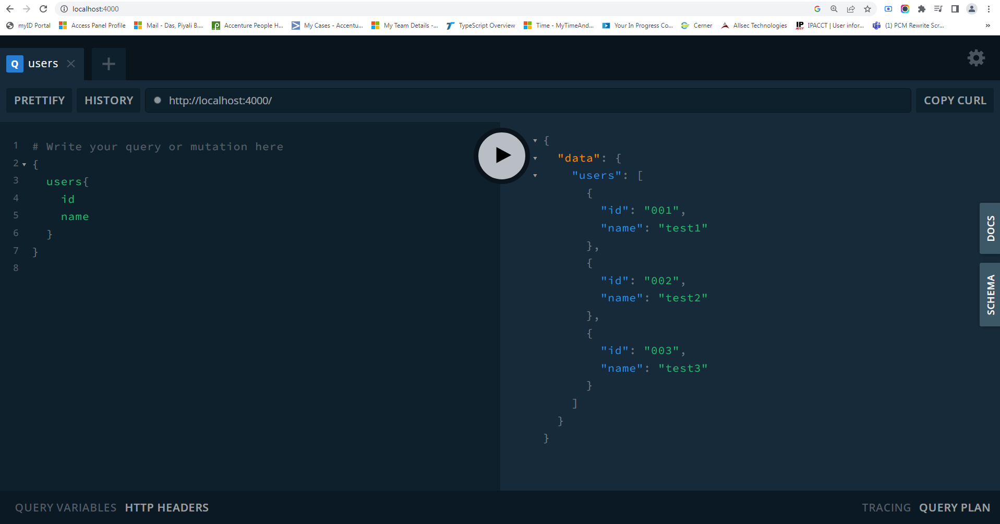
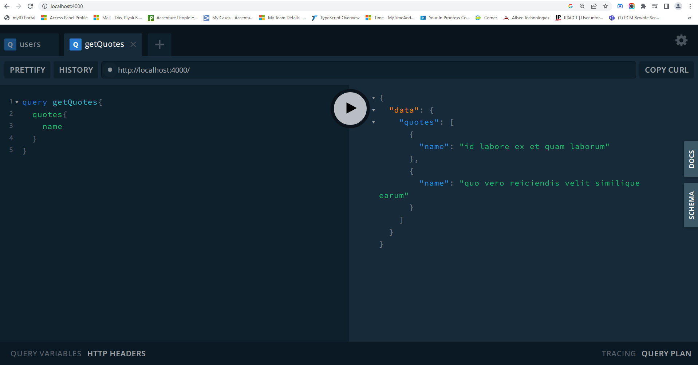

### users query
```
{
  users{
    id
    name
  }
}
```


### quotes query
```
query getQuotes{
  quotes{
    name
  }
}
```


### Nodejs 12
In case you're running nodemon for the Node.js version 12, use this command.

```
const { ApolloServer, gql } = require('apollo-server');
const {ApolloServerPluginLandingPageGraphQLPlayground} = require('apollo-server-core');
```

remove "type": "module",

### GraphQL playground
```
lugins:[
        ApolloServerPluginLandingPageGraphQLPlayground()
    ]
```