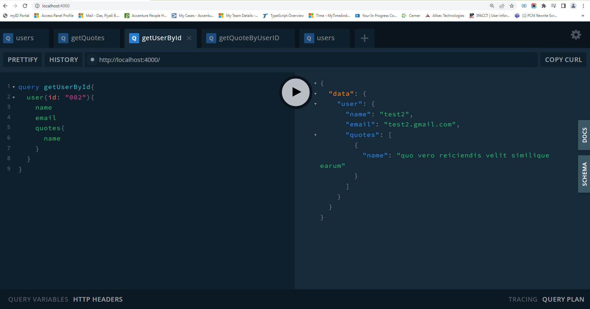
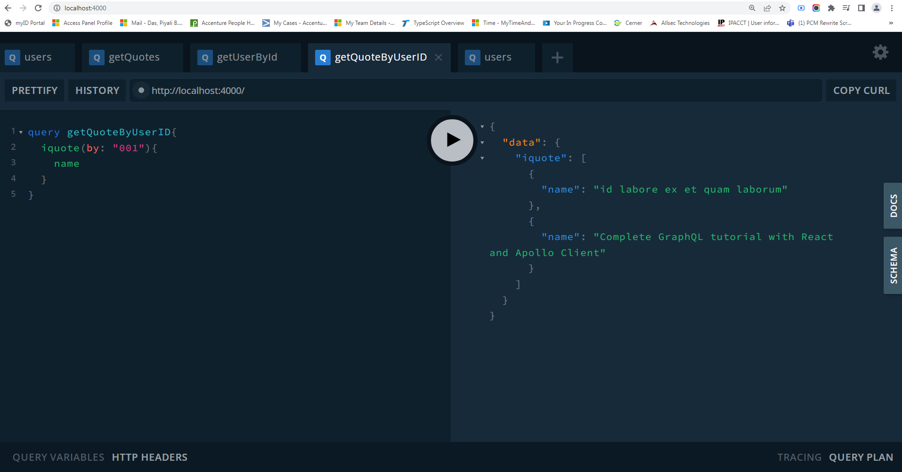
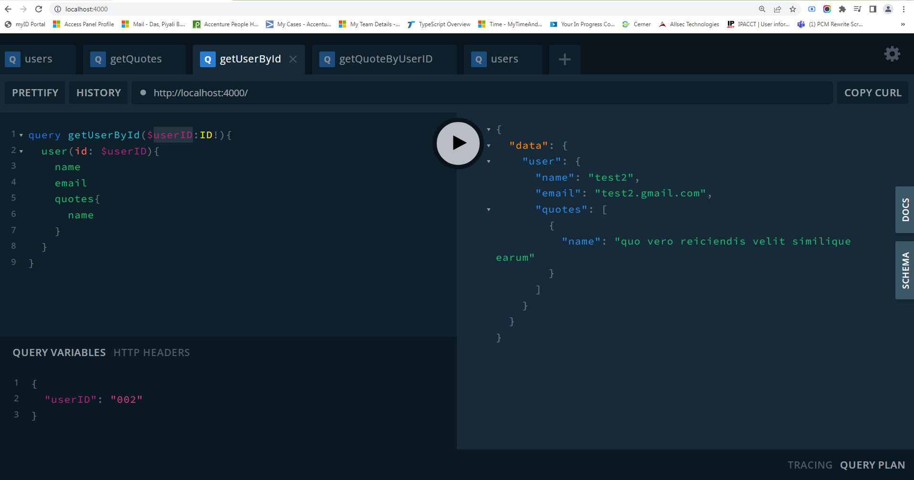

### getUserById query
```
query getUserById{
  user(id: "002"){
    name
    email
    quotes{
      name
    }
  }
}
```



### getQuoteByUserID query
```
query getQuoteByUserID{
  iquote(by: "001"){
    name
  }
}
```


### getQuoteByUserID query with query variable
```
query getUserById($userID:ID!){
  user(id: $userID){
    name
    email
    quotes{
      name
    }
  }
}

{
  "userID": "002"
}
```


### Nodejs 12
In case you're running nodemon for the Node.js version 12, use this command.

```
const { ApolloServer, gql } = require('apollo-server');
const {ApolloServerPluginLandingPageGraphQLPlayground} = require('apollo-server-core');
```

remove "type": "module",

### GraphQL playground
```
lugins:[
        ApolloServerPluginLandingPageGraphQLPlayground()
    ]
```


https://github.com/do-community/graphql-recipe-server
https://www.youtube.com/watch?v=MLNnKFxua8E&list=PLB97yPrFwo5i9zDrWfvkohPec3Q6EEC9J&index=5
