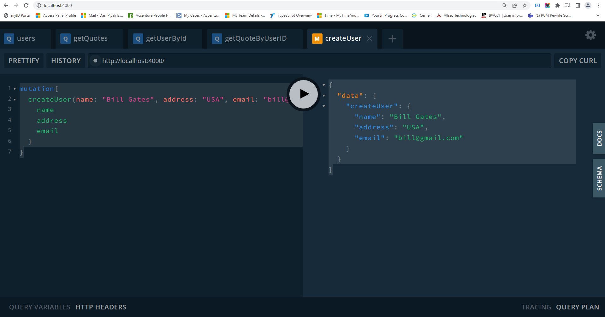
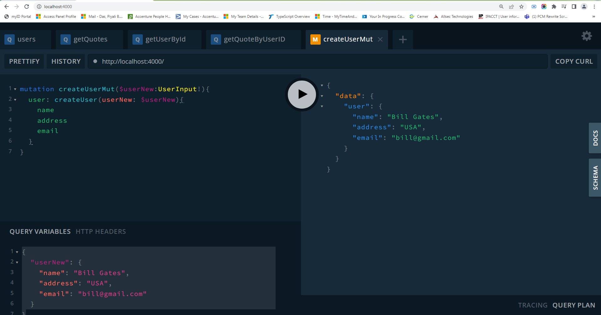

### createUser mutation
typeDefs-----------
type Mutation{
    createUser(name:String!, address:String!, email:String!): User
}

resolvers-----------
Mutation:{
        createUser: (_,{name, address, email}) => {
            const id = randomBytes(5).toString("hex");
            users.push({
                id,
                name,
                address,
                email
            })
            return users.find(user => user.id === id)
        }
    }

```
mutation{
  createUser(name: "Bill Gates", address: "USA", email: "bill@gmail.com"){
    name
    address
    email
  }
}
```



### createUser mutation with variable & alias (user)
user: is a alias

```
mutation createUserMut($userNew:UserInput!){
  user: createUser(userNew: $userNew){
    name
    address
    email
  }
}
```

{
  "userNew": {
    "name": "Bill Gates",
    "address": "USA",
    "email": "bill@gmail.com"
	}
}




### Nodejs 12
In case you're running nodemon for the Node.js version 12, use this command.

```
const { ApolloServer, gql } = require('apollo-server');
const {ApolloServerPluginLandingPageGraphQLPlayground} = require('apollo-server-core');
```

remove "type": "module",

### GraphQL playground
```
lugins:[
        ApolloServerPluginLandingPageGraphQLPlayground()
    ]
```


https://github.com/do-community/graphql-recipe-server
https://www.youtube.com/watch?v=MLNnKFxua8E&list=PLB97yPrFwo5i9zDrWfvkohPec3Q6EEC9J&index=5
